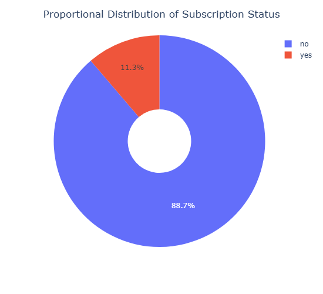
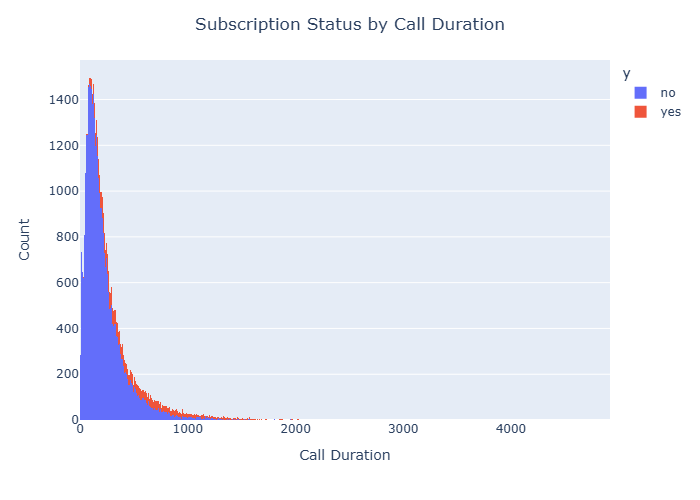
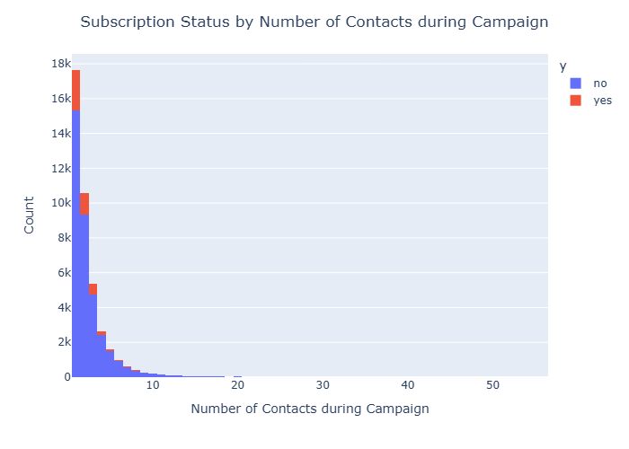
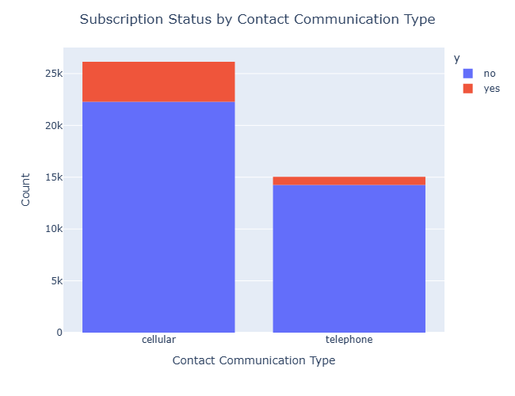
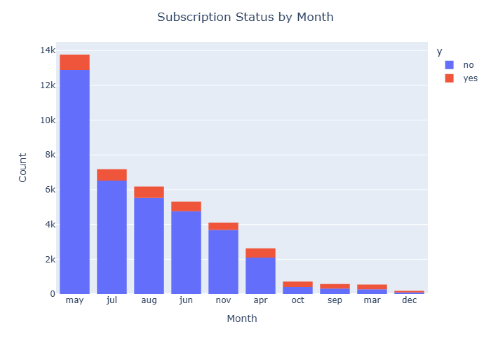
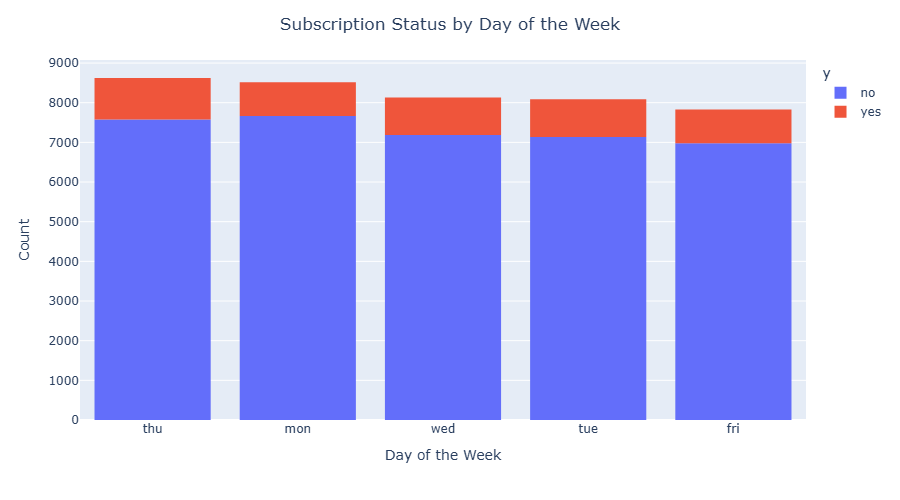
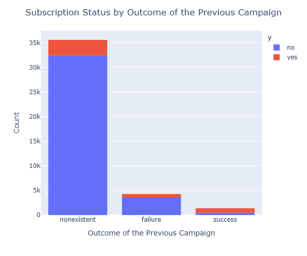

# compare-classifiers
Compare the performance of different classification models (Logistic Regression, Decision Trees, K-Nearest Neighbor, and Support Vector Machines) 

### Link to Jupyter Notebook
https://github.com/amanbhardwaj/compare-classifiers/blob/main/prompt_III.ipynb

### Business Objective
<mark>The business objective is to predict the effectiveness of direct phone campaign by a bank for the subscription of term deposit by its customers based on the data from bank's multiple previous direct product marketing campaigns over the phone.</mark> 

The direct phone campaign data contains campaign features such as <b>phone contact communication type, last contact day of the week, last contact month of the year, and last contact duration, number of times client was contacted for the campaign, number of times client was contacted before the campaign, days passed since client was last contacted for the previous campaign, outcome of the previous campaign, and has the client subscribed to term deposit</b>.

In order to achieve the business objective, we are tasked to compare the performance of different classification models (Logistic Regression, Decision Trees, K-Nearest Neighbors, and Support Vector Machines) when used with the direct phone marketing campaign data and pick the best performing model based on highest accuracy and precision.

### Data Visualizations:

### Baseline Model
##### Majority Class (Zero Rule / ZeroR): This strategy always predicts the most frequent label in the training set.

Most frequent label in our dataset = 'no' with 88.73%. So, we should be looking for <mark><b>Accuracy > 88%</b></mark>, but we have class imbalance with only 11% 'yes'.

##### <mark>Therefore the baseline performance should also be measured using  <b>F1-Score / Precision-Recall</b></mark>

### Initial Simple Model
Built a Logistic Regression model with preprocessing (Standard Scaling of numeric features and One-Hot Encoding for categorical features).

#### Model Scoring
Accuracy of our simple model (Logistic Regression) is 85%. We were looking for 88%.

As reported in the Classification Report above, the model has very high F1-Score / Precision-Recall.

Precision is 97%
Recall is 86%
F1-Score is 91%

### Model Comparisons
Compared the performance of the Logistic Regression model to K-Nearest Neighbors, Decision Tree Classifier, and Support Vector Classifier, using the default settings for each of the models.

Model Comparisons using default settings:
| Model                      | Train Time | Train Accuracy | Test Accuracy |
| -------------------------- | ---------- | -------------- | ------------- |
| Logistic Regression        | 0.087131   |   0.849972     |  0.848980     |
| K-Nearest Neighbors        | 0.029381   |   0.927987     |  0.900777     |
| Decision Tree Classifier   | 0.148724   |   0.995144     |  0.880787     |
| Support Vector Classifier  | 4.514066   |   0.915048     |  0.908223     |

### Improving the Model
Compared the performance of the Logistic Regression model to K-Nearest Neighbors, Decision Tree Classifier, and Support Vector Classifier, using the hyperparameter tuning and grid search CV.

Model Comparisons
Model: LogisticRegression 			Hyperparameters: {'LogisticRegression__C': [0.1, 1, 10]}
Model: KNearestNeighbors 			  Hyperparameters: {'KNearestNeighbors__n_neighbors': [3, 5, 7]}
Model: DecisionTreeClassifier 	Hyperparameters: {'DecisionTreeClassifier__max_depth': [5, 10, 15]}
Model: SupportVectorClassifier 	Hyperparameters: {'SupportVectorClassifier__C': [0.1, 1, 10], 'SupportVectorClassifier__kernel': ['linear', 'rbf']}

Model Comparisons using hyperparameter tuning:
| Model                      | Train Time | Train Accuracy | Test Accuracy |
| -------------------------- | ---------- | -------------- | ------------- |
| Logistic Regression        |  0.869928  |   0.849972     |  0.848980     |
| K-Nearest Neighbors        |  0.625277  |   0.923789     |  0.903124     |
| Decision Tree Classifier   |  0.103705  |   0.911544     |  0.908223     |
| Support Vector Classifier  | 40.406801  |   0.915048     |  0.908223     |

### Conclusion
Without hyperparameter tuning:

- K-Nearest Neighbors model took the least training time and had very high test accuracy (92%) and train accuracy (90%).
- Desision Trees Classifier model had the best train accuracy (99.5%) but lower test accuracy (88%).
- Support Vector Classifier model had the best test accuracy (90.8%), but took may more time in training as compared to other models.
- Overall, without hyperparameters tuning K-Nearest Neighbors performed the best in terms of training time and accuracy (90%).

Without hyperparameter tuning:

- All models except for Desision Trees Classifier, took more time for training without any gain in train or test accuracy.
- Desision Trees Classifier did not take any more time for training and its test accuracy improved (90.8%) but train accuracy decreased (91%).
- Support Vector Classifier model took extremely log time in training. The code reported 40 seconds but in reality it took about 5 minutes.
- Overall, with hyperparameters tuning Desision Trees Classifier performed the best in terms of training time and accuracy (90.8%).
